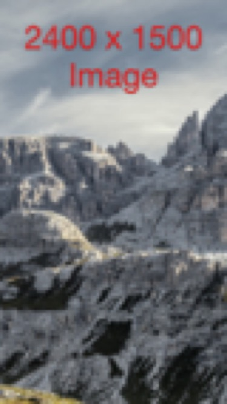
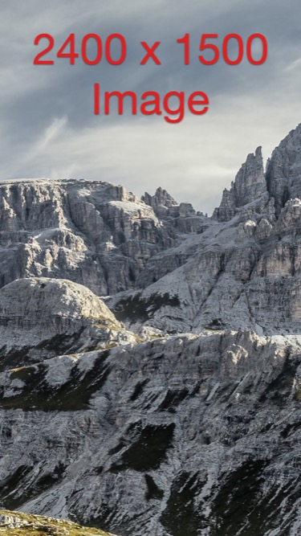

# ImageSaveExample

iOS / Swift example of clipping part of a UIImage and scaling it to target size.

Allows specifying:

- scaleToFill
- scaleAspectFit
- scaleAspectFill
- explicit pixel dimensions or screenScale dimensions

Example output using UIView Extension:

Example output using UIImage Extension:

